#  Petunia Tienda

**Petunia Tienda** es una página web diseñada para ofrecer regalos únicos para cada ocasión especial. Es un sitio 100% responsivo, optimizado para SEO y desarrollado con tecnologías modernas de frontend.  
[Visítala aquí](https://www.petuniatienda.me)

---

## Tecnologías usadas

- HTML5
- CSS3 (con diseño responsive)
- JavaScript vanilla (en proceso)
- Google Fonts
- Hosting: GitHub Pages
- Dominio personalizado `.me`

---

##  Estructura del proyecto

```
PetuniaTienda/
├── index.html
├── about.html
├── contact.html
├── services.html
├── register.html
├── login.html
├── panel.html
│
├── css/
│   └── style.css
│
├── img/
│   ├── logo.png
│   └── otros recursos...
│
└── README.md
```

---

##  Cómo ejecutarlo localmente

1. Clona el repositorio:

```bash
git clone https://github.com/tuusuario/petunia-tienda.git
```

2. Abre el archivo `index.html` con tu navegador:

```bash
start index.html      # Windows
open index.html       # macOS
xdg-open index.html   # Linux
```

---

## Características

- Diseño limpio, moderno y amigable
- Optimización SEO básica (`meta`, `alt`, `aria-label`)
- Responsive y accesible desde móviles
- Imágenes con carga diferida (`loading="lazy"`)
- Código limpio, organizado por secciones

---

##  Futuras mejoras

- Carrito de compras
- Backend con Node.js + Express
- Sistema de login real con validación
- Panel de administración para productos
- Base de datos con MongoDB o PostgreSQL
- Funcionalidades dinámicas con JavaScript

```mermaid
graph TD
    A["Usuario - navegador"] --> B["DNS: petuniatienda.me"]
    B --> C["IP del servidor web"]
    C --> D["Petición HTTPS a /index.html"]

    D --> E["Servidor Web (Hosting)"]
    E --> F["index.html"]
    F --> G["style.css"]
    F --> H["logo.png y otros recursos - img/"]
    F --> I["JS, fuentes, iconos..."]

    F --> J["about.html"]
    F --> K["contact.html"]
    F --> L["services.html"]
    F --> M["login.html"]
    F --> N["register.html"]
    F --> O["panel.html"]

    A --> P["Interacciones de Usuario"]
    P --> Q["Registrarse"]
    P --> R["Iniciar sesión"]
    P --> S["Ver panel"]

    Q --> N
    R --> M
    S --> O
```



---

## 👨‍💻 Autor

- **Andrés Contreras** – Desarrollador principal  
  GitHub: [@andresdevgithub](https://github.com/andresdevgithub)  
  Proyecto personal desarrollado como parte de su portafolio profesional.

---

## 📄 Licencia

Este proyecto está licenciado bajo los términos de la licencia MIT.  
Consulta el archivo [LICENSE](LICENSE) para más detalles.


